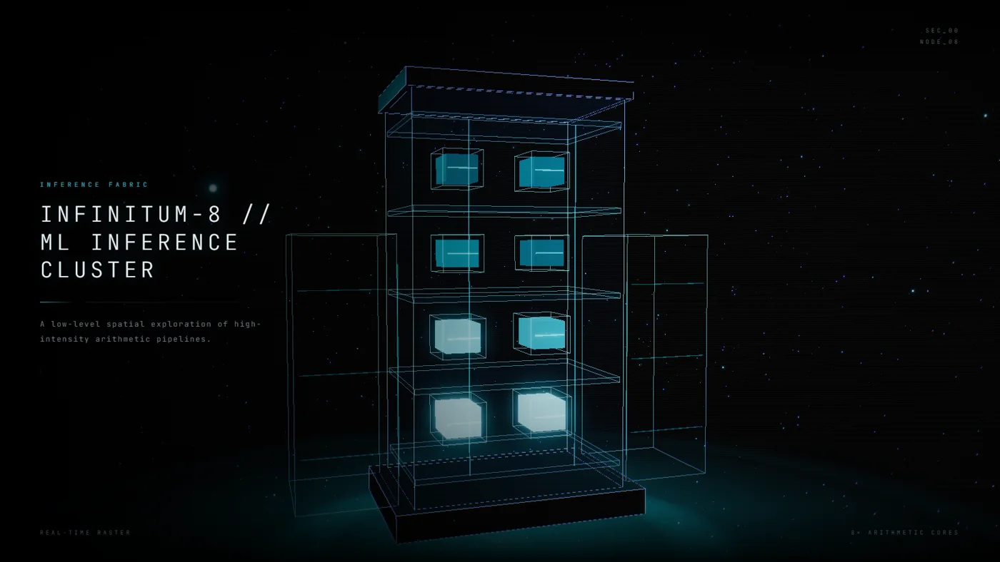
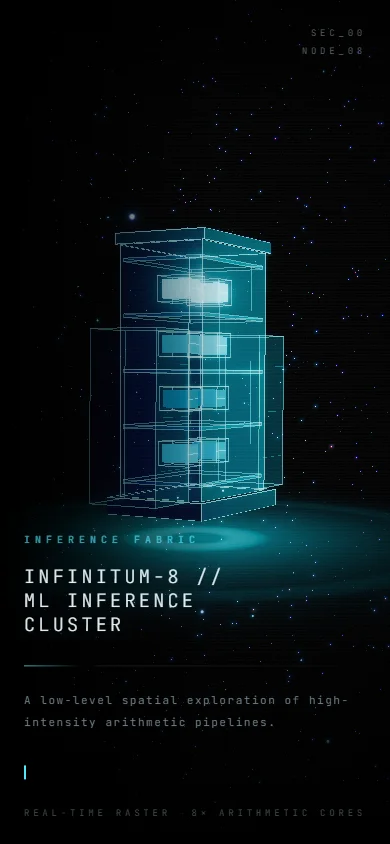

# THE INFINITUM NODE

> A low-level spatial exploration of high-intensity arithmetic pipelines.

A hyper-minimalist, single-page 3D cinematic landing page. It is purely
experiential and deliberately featureless: no navigation, no buttons, no
settings, no sliders, no forms. There is exactly one thing to do — look at it and
move the cursor.

**Live: <https://bruce12-glitch.github.io/cluster/>**



<p align="center">
  
</p>

---

## What it is

A monolithic server rack array, rendered in a pitch-black void. Semi-transparent
frosted glass panels and hairline neon wireframes form the chassis; inside it,
eight holographic GPU cores pulse on a staggered 2×4 arithmetic fabric. The whole
assembly orbits and tilts in zero gravity, thousands of star-particles drift
around it as token data streams, and the camera leans into the cursor.

## Stack

| Concern      | Choice                                                |
| ------------ | ----------------------------------------------------- |
| App          | React 19 + TypeScript, bundled by Vite                |
| 3D           | three.js via `@react-three/fiber` + `@react-three/drei` |
| Post         | `@react-three/postprocessing` (bloom, chromatic aberration, vignette, grain) |
| Styling      | Tailwind CSS v4 (CSS-first `@theme` tokens)           |
| Type         | JetBrains Mono Variable, self-hosted                  |

## Running it

```bash
npm install
npm run dev        # http://localhost:5173
npm run build      # tsc --noEmit && vite build
npm run preview    # serve the production bundle
```

## Deploying

The site is served by GitHub Pages from the `gh-pages` branch at
<https://bruce12-glitch.github.io/cluster/>.

```bash
npm run deploy
```

That builds, stages `dist/` into a scratch directory, and force-pushes it as an
orphan `gh-pages` branch. Pages then rebuilds in about thirty seconds.

Two details make this work:

- **`base: './'` in `vite.config.ts`.** Pages serves a project repo from
  `/<repo>/`, not from the domain root, so an absolute `/assets/...` base would
  404. A relative base works from a subpath, from the root, and from `file://`.
- **`.nojekyll`.** Pages runs Jekyll by default, which would try to process the
  build output. An empty `.nojekyll` at the root of `gh-pages` disables that.

The deploy script stages into a temp directory rather than using `git subtree`,
because `dist/` is gitignored — there is nothing committed for subtree to push.
Keeping the build on its own orphan branch means `main` stays source-only and
`gh-pages` stays build-only, with no generated files in the main history.

---

## Composition

```
src/
├── App.tsx                     three stacked layers, in paint order
├── index.css                   design tokens, atmosphere, keyframes
├── hooks/
│   ├── usePointer.ts           ref-based cursor tracking (never re-renders)
│   └── usePrefersReducedMotion.ts
├── lib/
│   ├── layout.ts               every dimension in the scene, in one place
│   ├── palette.ts              the shared colour contract
│   └── random.ts               seeded PRNG → deterministic constellations
├── scene/
│   ├── Experience.tsx          the <Canvas> and its composition
│   ├── CameraRig.tsx           ambient drift + damped cursor parallax
│   ├── ServerCluster.tsx       the monument: orbit, tilt, float
│   ├── GlassShell.tsx          frosted panel / wireframe / seam / solid block
│   ├── GpuArray.tsx            the eight pulsating cores
│   ├── ParticleField.tsx       constellation + token streams
│   ├── EnergyFloor.tsx         the light pool the cluster sits in
│   ├── KineticLights.tsx       three orbiting point lights
│   ├── StudioEnvironment.tsx   procedural (baked) reflection map
│   ├── Effects.tsx             the post-processing chain
│   ├── FrameGovernor.tsx       adaptive resolution, invisible
│   └── shaders/particles.ts    the particle GLSL
└── overlay/
    ├── Atmosphere.tsx          vignette, scanlines, film grain
    └── Typography.tsx          the landing copy — and nothing else
```

---

## Performance notes

The frame budget is the design constraint, so a few decisions are deliberate:

**Nothing allocates in the frame loop.** Every geometry, material, colour and
vector is built once at mount. The render loop only writes to numbers that
already exist. `lib/random.ts` exists so the particle field is generated from a
seed rather than re-rolled, which also makes the composition reproducible.

**The particle simulation runs on the GPU.** 8,000 star-particles plus 700 token
streaks are two `BufferGeometry` point clouds — two draw calls. Twinkle is a pair
of detuned sines in the vertex shader; the streams' infinite wrap-around is a
single `mod`. The CPU never touches a particle after construction.

**No shadows, no transmission.** Real glass refraction (`transmission`) costs an
extra full scene pass per frame, and shadow maps cost another. The frosted panels
use clearcoat plus a little iridescence over a cold, near-black tint, lit by three
orbiting point lights and a 64px environment map baked exactly once.

**One tone-mapping step.** The renderer runs with tone mapping off
(`<Canvas flat>`), so the scene is drawn in linear light, all effects operate on
linear values, and a single ACES curve is applied at the end of the chain.
Nothing is converted twice.

**The resolution is adaptive.** `FrameGovernor` watches a rolling frame-time
average and steps the device pixel ratio between 0.75 and 1.5. The first time it
has to downgrade, that level becomes the new ceiling — a ratchet, so the image can
never oscillate between two resolutions — and after a sustained stretch of
comfortable frames the ceiling is handed back a step, so a machine that was merely
busy for a moment is not punished for the rest of the session.

Measured at 1600×900 on Intel UHD integrated graphics: **121fps** for the scene
alone, **~45fps** once the post chain is added, and **~62fps** after the
optimisations above. That last figure is the point of the whole exercise — the
post chain, not the geometry, was the entire performance story, and the two
effects that were removed (`Vignette`, `Noise`) were the two that CSS could
already do for free.

**Disposal is explicit.** Every geometry and material created outside R3F's
declarative tree is disposed in an effect cleanup. The throwaway `BoxGeometry`
used to extract edge lists is disposed the instant its `EdgesGeometry` exists.

## Accessibility

`prefers-reduced-motion` is honoured: the orbit, parallax and drift all slow to a
near-still composition rather than stopping outright. The headline is a real
`<h1>`, and the atmosphere layer is `aria-hidden` and `pointer-events-none`.

## Licence

MIT.
